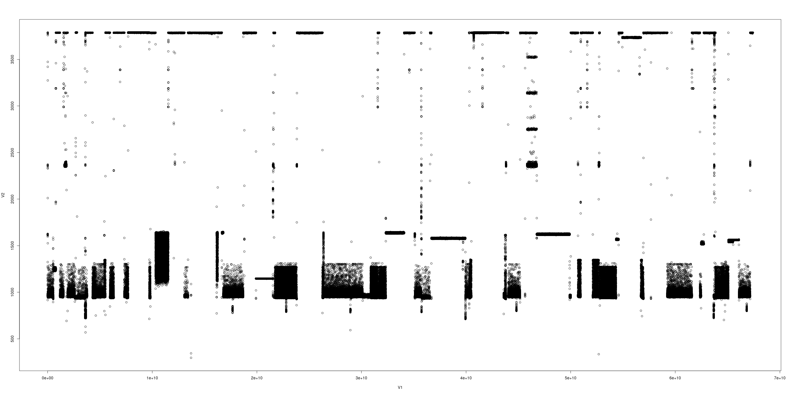

# IPC Variability and Performance Bands
Barret Rhoden <brho@google.com> \
2025-05-05

Ron ran into some crazy FTQ raw data on Sapphire Rapids.
I was able to recreate it, but then noticed that the issue depended on compiler flags.
But more disturbingly, the more we isolated a cpu, the worse things got!

As a preview, check out the raw data for gcc baseline and gcc unroll, the latter of which was just with some #pragmas to unroll the inner loops of main_loops:

###### SPR GCC Baseline (no isolation, no tasksetting):


###### SPR GCC Unrolled (no isolation, no tasksetting):


GCC Unrolled looks noisy, but understandable.
GCC Baseline looks bizarre.
Though I have seen that X pattern before - it might have been when running a nested VM on Linux.

## What is a Band?
A band is a horizontal line in the raw data.
From [Bands and anomalies from 2017](./bands_and_anomalies.md) I described a band as resulting from a pattern in the raw data like `{710, 711, 710, 720}`.
When zoomed out, it looks like those bands happen concurrently, but it was rapidly cycling between those values.

However, other bands are more obviously *steps*, which you'd see from e.g. turbo mode kicking on or from jumping between various P-states.
I don't have a great example handy, but from 2017 you can see some bands early on that are likely different P-states.
###### 2017 Tinycore Linux *Guest* on cpu 0, 10kHz (with turbo)


Yet the banding we're seeing now on SPR is far worse than percentage points.
We're talking a 5-6x difference from the top band (4174) to the low band (780).

In contrast to the bands made by rapidly alternating between a few values, what we're seeing is several intervals in a *degraded* mode:

###### Raw counts from 10kHz freq, 100usec interval
```
34187736725 4174
34187836734 4174
34187936736 2830
34188036790 780
34188136809 780
34188236820 779
34188336721 780
34188436732 780
34188536779 780
34188636810 779
34188736735 780
34188836741 780
34188936796 2000
34189036723 4174
34189136731 4173
```

In that example, we were at the *low band* for about 10 intervals = 1ms.
We still alternate quickly between low bands and high bands: the naked eye can't see a 1ms band in the raw data any more than it can see a single data point.

But the *nature* of our bands differs from before in that we're in the degraded mode for an extended period of time.
Why?  Some options:
- Lower P-state?  5x lower performance is too much of a step.
- Context switching or other threads?  Each interval is degraded by the same amount, which makes it extremely unlikely that some other thread ran for e.g. 3300 counts at our exact interval boundaries.
- Thermal or voltage throttling?  Maybe!
- Other nightmares?  This.  Read on.

## Why the X Patterns?
GCC-baseline has an unmistakable X pattern.  (Actually, a few Xs of different shape).
Presumably whenever you transition from one band to another, you can have an intermediate sample where the transition happens somewhere in the middle of the interval.
i.e. what are the odds that the step happens right at an interval boundary?

That intermediate sample's count can be anywhere in between High and Low, and presumably it is uniformly distributed.
So having intermediate values that aren't in any band ought to be OK.
Yet we have those intermediate values monotonically increase/decrease on a scale of seconds...

Consider this interval:
```
34187736725 4174
34187836734 4174
34187936736 2830
34188036790 780
34188136809 780
34188236820 779
34188336721 780
34188436732 780
34188536779 780
34188636810 779
34188736735 780
34188836741 780
34188936796 2000
34189036723 4174
34189136731 4173
```

2830 and 2000 were likely intermediate samples: part way through the 2830 interval, we dropped from 4174 to 780.

Look at the next down-step right after that:
```
34191236712 4166
34191336730 4165
34191436723 1346
34191536749 1311
34191636771 1344
34191736748 1343
34191836712 1311
34191936738 1104
34192036807 780
34192136823 779
34192236710 780
34192336734 789
34192436801 789
34192536814 788
34192636736 789
34192736749 789
34192836765 789
34192936795 2023
34193036698 4119
34193136702 4119
```

2830, 2000, and 2023 look like intermediate hits.
The 1300s look like another band, which we sat at for 500us.
This example was *two* down steps.  One from 4166 to 1311, then another to 789.

### The X Interference is Periodic

Imagine the degrading interference occurs at exactly 100Hz for 1ms (i.e. every 100ms for 1ms), and it occurs exactly on the boundary of a sample.
In that case, you'd expect something like this synthetic example:
```
00007700000 4174
00007800000 4174
00007900000 4174
00008000000 780
00008100000 780
00008200000 779
00008300000 780
00008400000 780
00008500000 780
00008600000 779
00008700000 780
00008800000 780
00008900000 780
00009000000 4174
00009100000 4173
...
00017700000 4174
00017800000 4174
00017900000 4174
00018000000 780
00018100000 780
00018200000 779
00018300000 780
00018400000 780
00018500000 780
00018600000 779
00018700000 780
00018800000 780
00018900000 780
00019000000 4174
00019100000 4173
```
There are no intermediate values, just steps between the high and low band.

Now consider if the interference is still 100Hz and 1ms, but not aligned with a sample boundary.
In that case, you'd get edge samples like 2830 and 2000 above.
Every edge sample from high to low would be 2830, and every sample from low to high would be 2000.
Let's call {2830, 2000} and "up-down" pair.

Now consider that the frequency is of the interference is 101Hz, or anything just slightly more than 100Hz.
Each time the degraded mode occurs, it'll be a little earlier in each intermediate sample.
In that case, the *series of up-down pairs* (which are the boundaries between 4174 and 780) could be something like:
```
{2830, 2000}, 
{2829, 2001}, 
{2828, 2002}, 
{2827, 2003}, 
{2826, 2004}, 
```
Eventually, we'll hit the edge cases {780, 4174} and {4174, 780}.
These edges are when the degraded interference is in phase with FTQ's 10kHz.
And all of those intermediate values slowly, mostly-monotonically move from edge to edge.

That could create the X pattern when you zoom out: brief samples at the intermediate points that slowly increase.
If it's easier, instead of going from 780..4174, consider 0%..100%.
At the left-most part of the X, we're at {99%, 1%}.
Next time we degrade, the interference is slightly later and we're at {98%, 2%}.
If you have a slow drift in the interference start time, you'll slowly work your way across the X, from left to right.

For all this to happen, you'd need
- Interference that spans multiple intervals.
- The length of the interference to be close to a multiple of the interval (to get the N%,(100-N)% split for a given value on the x axis)
- The period of start times to be close to the interval freq.  But not exactly, so you can drift.

And the "not exactly" part could be either due to N + (100 - N) not being exactly 100 (e.g. every 1000Hz i interfere for 101us: just over the interval) or by the freq to be off (e.g. every 999 Hz i interfere for 100us: exactly the interval, but not quite at the same time)

And the bit about "spanning" multiple intervals: the reason we don't see this on HPC / Akaros / Quieter machines is that you have to be relatively noisy to see this in the first place.
In quiet machines, interference can fit in 100us.
But noisy machines, you'll be out to lunch (either descheduled or time sharing 50/50) for several msec.
> Note from the future: this wasn't actually "interference"!, but the point still stands: you need to be degraded for multiple intervals.

### OK, How Can We Tell?
So some form of interference-inducing behavior that causes the steps, and it occurs close to some divisor of 10kHz.
Hmmm, what about timer ticks?  Lots of things in the OS are at 1kHz.

Not sure if this is the actual cause, but let's change FTQ's frequency to 7777Hz and see if the pattern persists:
###### SPR GCC Baseline 10kHz pinned to a cpu

###### SPR GCC Baseline 7777Hz pinned to a cpu


The horrendous bands are there, but the Xs are gone!
Recall my commentary from [Bands and anomalies from 2017](./bands_and_anomalies.md#the-40-hz-signal):
> The moral of the story is that you need to run FTQ at two different frequencies, neither of which is a multiple of the other, so that we can see if a signal is due to the benchmark or an external source of interference (like the OS).

So one hint: something periodic and with a frequency that is a multple to a divisor of 10kHz might be involved.  e.g. something every N timer ticks.
And the duration might also be close to a multiple of the interval length.  e.g. 1ms.

Side note: "just always run FTQ at -f 7777" will not necessarily save you.
If your interference is also close to that frequency, then you might get the X still.
It's just that 7777 is a lot less likely than a multiple of 1000 in any rational system.  =)

And if your interference length isn't close to the interval, you might not see a nice even X, but you could see something like a line with a slope.
e.g. at 10100Hz your perf degrades for an arbitrary amount of time.
Your "start time" degradation could show as a steady line sloping down.
But the "degredation turned off" at an arbitrary time, which would pop up as noise.
Ron saw the "top band" slope downwards at one point - perhaps this was happening.

## Sapphire Rapids versus Milan

OK, let's only look at 7777Hz FTQs.
But we still have a problem: SPR has that band that's several factors less than its upper band.
Milan does not; it looks like a typical Linux cpu.

Here's the side-by-side:

###### SPR GCC Baseline 7777Hz pinned to a cpu


###### Milan GCC Baseline 7777Hz pinned to a cpu


Let's dig in a bit more...

## Compiler Flags?!?

In an attempt to build FTQ for a nightly test runner, I compiled it with clang.
Suddenly SPR wasn't nearly as bad!

###### SPR Clang 7777Hz pinned to a cpu


You can see a few "high" bands, which I'd expect to see due to P-state changes or similar behavior.
From looking at the assembly, the biggest difference between GCC-baseline and clang was whether or not we unrolled the loop.
Let's look at GCC with a pragma to unroll:

###### SPR GCC Unroll 7777Hz pinned to a cpu


Not quite as good as Clang, but much better than baseline.
GCC-unroll has a fair number of samples that are well below the "full speed" bands.

After playing around a bit, running with no optimizations (-O0) was the worst of all!

###### SPR GCC Noopt 7777Hz pinned to a cpu


It still has a high band on occasion, but more of the samples are in the lower bands than the upper.
What gives?


## Isolation Makes It Worse!?!
At this point, the difference is compiler flags.
Something to do with branching?  (too many, too few, prediction buffers?)  Loop targets?

Let's rule out any form of OS interference:
- Disable hyperthreading
- Turn off the timer tick (nohz_full)
- Use isolcpus to get everyone else off our cpu
- Route IRQs away from our cpu

To do this, I just kexec'd the existing kernel with a few more command line arguments:
```
# kexec -l --append="nosmt=force nohz_full=16 isolcpus=domain,managed_irq,16 irqaffinity=0-15,17-$MAX" /boot/vmlinuz-current
# kexec -e
```

We've got our isolated cpu, and it's the worst FTQ raw data you've ever seen:

###### SPR GCC Noopt 7777Hz pinned to an Isolated cpu


The biggest standout from that graph is that the "bands" aren't even bands: they are chunks!
Instead of sitting at the lower band for 1ms, we'll go several *seconds* without reaching the higher band.
It's like we've zoomed in on the previous band phenomena.

Thermal stuff?
Highly doubtful.
Not on the order of seconds on a quiet machine, that depends on compiler optimizations.

###### SPR GCC Baseline 7777Hz pinned to an Isolated cpu


And GCC baseline (-O2) looked bad.
Not quite as scary, but still had the large gaps.

###### SPR Clang 7777Hz pinned to an Isolated cpu


Clang looked pretty good, though it did have some gaps where it was at a lower band - but just slightly lower.

As another metric, consider the FTQ Fraction, which is total_count / total_possible_count, i.e. "if we had no interference, we should get 100%"
- Clang: .995
- GCC unroll: .989
- GCC baseline: .772
- GCC noopt: .593

We can get a mostly quiet cpu.
It's not SMM or other mysterious interference.
It's some form of a degraded mode that lasts for O(seconds).
Not only does the behavior depend on compiler flags, but the quieter the node is, the worse it is!

It's as if getting an occasional timer-tick interrupt *helps* break us out of whatever low-performance, degraded mode we're in.

## It's All About IPC Variations
At this point, I found someone who knows about Intel hardware.

Their (anonymous) writeup warrants its own [file](./ftq_spr_memory_renaming.md).
Read that now and then come back.
Short version: Golden Cove (i.e. SPR) has hardware optimizations that speed up FTQ's loop, but they are not applied evenly to every invocation of the inner loops.
Specifically, it can rename memory addresses as registers, bypassing store-to-load forwarding.
The unrolled code can take advantage of this more easily and more reliably than the unoptimized code.

### Bottom Line
FTQ's work function (the guts of `main_loops()`) is supposed to be constant for a given machine.
If you're running on the cpu, each iteration should take the same number of cycles, barring any actual interference.
These microarchitectural variations in IPC from one loop to the next break the benchmark.

In the version of FTQ used for these benchmarks, we had `count` be `volatile`.
This forced the compiler to write the count back to the stack, engaging the store-forwarding delay.
On machines without memory renaming, this was a fixed delay inserted into the loop (5 cycles, as per that Doc).
Essentially we were forcing the code to be slow, and thus more predictable.
On machines with memory renaming, e.g. SPR, that delay might be non-existant and not even a micro-op, or it might be 5 cycles if the renamer can't handle it.
That's a huge swing in IPC: specifically the *high* and *low* bands we see in the raw data.

### Renaming and immediates
On a related topic, did you know that shift can take either 3 cycles or 1, and it depends on whether you did a mov to rcx (64 bit) versus ecx (32 bit)?
Check [out](https://tavianator.com/2025/shlx.html) [these](https://tavianator.com/2025/shlxplained.html) [links](https://news.ycombinator.com/item?id=42579969).
The guts of the issue is that Golden Cove's renamer can also store an immediate.
So if you say rax = rdx + 1, it may skip the addition and just say "assign a new internal register to whatever rdx is, +1"
Guess what benchmark does a lot of +1s and -1s?
FTQ.

I don't know if the renamer-immediate stuff came in to play with FTQ on SPR, that gives you the sense for what all can go on.

### The impact of IRQs
Both the memory renaming and the renamer-immediate stuff are affected by interrupts.
One of the comments about shl's 3 cycle performance mentioned that if you push and pop rcx, shift will go back to being 1 cycle.
The reason is that once rcx is pushed to the stack, the processor is forced to resolve the immediate, and when you pop it back into rcx, it's just a regular register.
And then it isn't getting the "3 cycle shift" treatment.
Based on that [writeup above](./ftq_spr_memory_renaming.md), interrupts can also interfere with the memory renamer, possibly allowing it to get back to "normal" speeds.

The hardware has optimizations (memory renaming) or deoptimization (renaming + immediate impacting shift with rcx), both of which can change based on whether we get interrupted.
If the memory renamer gets in a funk (apparently there's some training/history that goes on) and we're getting 0.5 IPC, an interrupt can reset things such that we're getting 3 IPC.
Similarly, if an instruction is taking longer due to a renamed register + immediate, an interrupt can "flush" the immediate and get back to "normal".

In either case, the interrupt *helps* us.
Sound familiar?
That's what we saw when we isolated FTQ: as few IRQs and context-switches as possible, and *worse* performance.

So far, I referred to the High band as good / normal, and the Low band as degraded or interfered with.
But it may be the other way around: the Low band is normal and the High band is the hardware speedups!
In that sense, we're able to run way higher than we ought to, but the unoptimized code can't do it for very long and bounces back to a Low band.
Interrupts reset things, so we're able to run at a higher band for longer.

Remember the X pattern?
We needed the "degraded" condition to last for a certain amount of time, but that could just as easily be flipped around to say that we can only run in the High band for a certain amount of time: e.g. however long it takes for the memory renamer to get into a funk.
Similarly, we needed the degraded switch to occur on a frequency that shared a factor with 10kHz.
That can also be the switch from Low to High, instead of High to Low.
And what occurs at 1kHz?
A timer tick, which could reset us back to the High band.

Maybe.

### Loops!
The [writeup above](./ftq_spr_memory_renaming.md) also mentions that the unoptimized case has extra inner loops, which could affect the memory renamer.
Possibly due to the history buffer using the program counter.
The loop also has an extra dependency chain, making pressure on the renamer more intense.

Taken together, that explains why it seems that any extra loops have more variation.
Even on the final version of the code, with 20 floating point multiplications, I manually unrolled the code instead of using a for loop.
I saw more "noise" (IPC variation) with a for loop than with the code unrolled.

#### Loop Stream Detection
As a side note, did you know hardware can detect if you're in a loop?
Check [this](https://www.anandtech.com/show/2594/4) out.
Those FTQ inner loops of 32 and 31 iterations could be detected as a loop and sped up.
Not sure if this had an effect on FTQ, but it's the sort of thing that *could* be responsible for IPC variations.
And possible when I had a loop for 20 floating point multiplications.

## Current Results
Based on all of that, I changed FTQ's work function to be 20 floating point multiplications, unrolled.
This is the code currently submitted.

How does it look on SPR and Milan?
Not as quiet as I'd like, but at least it's similar.
FWIW, SPR's Fraction was .997, and Milan's was .990.
By that (arguably limited) metric, SPR was quieter!

But at least the results look sane.

###### SPR 20 Floats (isolated cpu)

###### Milan 20 Floats (isolated cpu)


## Appendix

Disassembly of ftqcore.o under various compilation options.
- GCC unroll was with #pragma
- noopt was with -O0
- I played around with page aligment; ignore that, had no effect on this.

GCC Unrolled
```
  3e:	0f ae e8             	lfence
  41:	0f 31                	rdtsc
  43:	48 c1 e2 20          	shl    $0x20,%rdx
  47:	89 c0                	mov    %eax,%eax
  49:	48 89 d6             	mov    %rdx,%rsi
  4c:	48 09 c6             	or     %rax,%rsi
  4f:	48 39 ce             	cmp    %rcx,%rsi
  52:	0f 83 89 03 00 00    	jae    3e1 <main_loops+0x3e1>
  58:	48 8b 44 24 f8       	mov    -0x8(%rsp),%rax
  5d:	48 83 c0 01          	add    $0x1,%rax
  61:	48 89 44 24 f8       	mov    %rax,-0x8(%rsp)
  66:	48 8b 44 24 f8       	mov    -0x8(%rsp),%rax
  6b:	48 83 c0 01          	add    $0x1,%rax
  6f:	48 89 44 24 f8       	mov    %rax,-0x8(%rsp)
  74:	48 8b 44 24 f8       	mov    -0x8(%rsp),%rax
  79:	48 83 c0 01          	add    $0x1,%rax
  7d:	48 89 44 24 f8       	mov    %rax,-0x8(%rsp)
  82:	48 8b 44 24 f8       	mov    -0x8(%rsp),%rax
  87:	48 83 c0 01          	add    $0x1,%rax
```

GCC Baseline
```
  3e:	0f ae e8             	lfence
  41:	0f 31                	rdtsc
  43:	48 c1 e2 20          	shl    $0x20,%rdx
  47:	89 c0                	mov    %eax,%eax
  49:	48 89 d6             	mov    %rdx,%rsi
  4c:	48 09 c6             	or     %rax,%rsi
  4f:	48 39 ce             	cmp    %rcx,%rsi
  52:	73 52                	jae    a6 <main_loops+0xa6>
  54:	0f 1f 40 00          	nopl   0x0(%rax)
  58:	ba 20 00 00 00       	mov    $0x20,%edx
  5d:	0f 1f 00             	nopl   (%rax)
  60:	48 8b 44 24 f8       	mov    -0x8(%rsp),%rax
  65:	48 83 c0 01          	add    $0x1,%rax
  69:	48 89 44 24 f8       	mov    %rax,-0x8(%rsp)
  6e:	83 ea 01             	sub    $0x1,%edx
  71:	75 ed                	jne    60 <main_loops+0x60>
  73:	ba 1f 00 00 00       	mov    $0x1f,%edx
  78:	0f 1f 84 00 00 00 00 	nopl   0x0(%rax,%rax,1)
  7f:	00 
  80:	48 8b 44 24 f8       	mov    -0x8(%rsp),%rax
  85:	48 83 e8 01          	sub    $0x1,%rax
  89:	48 89 44 24 f8       	mov    %rax,-0x8(%rsp)
  8e:	83 ea 01             	sub    $0x1,%edx
  91:	75 ed                	jne    80 <main_loops+0x80>
  93:	0f ae e8             	lfence
  96:	0f 31                	rdtsc
```


GCC Noopt
```
    1058:       c7 45 fc 00 00 00 00    movl   $0x0,-0x4(%rbp)
    105f:       eb 10                   jmp    1071 <main_loops+0x71>
    1061:       48 8b 45 c8             mov    -0x38(%rbp),%rax
    1065:       48 83 c0 01             add    $0x1,%rax
    1069:       48 89 45 c8             mov    %rax,-0x38(%rbp)
    106d:       83 45 fc 01             addl   $0x1,-0x4(%rbp)
    1071:       83 7d fc 1f             cmpl   $0x1f,-0x4(%rbp)
    1075:       7e ea                   jle    1061 <main_loops+0x61>
    1077:       c7 45 fc 00 00 00 00    movl   $0x0,-0x4(%rbp)
    107e:       eb 10                   jmp    1090 <main_loops+0x90>
    1080:       48 8b 45 c8             mov    -0x38(%rbp),%rax
    1084:       48 83 e8 01             sub    $0x1,%rax
    1088:       48 89 45 c8             mov    %rax,-0x38(%rbp)
    108c:       83 45 fc 01             addl   $0x1,-0x4(%rbp)
    1090:       83 7d fc 1e             cmpl   $0x1e,-0x4(%rbp)
    1094:       7e ea                   jle    1080 <main_loops+0x80>
    1096:       e8 65 ef ff ff          call   0 <getticks>
    109b:       48 89 45 e0             mov    %rax,-0x20(%rbp)
    109f:       48 8b 45 e0             mov    -0x20(%rbp),%rax
    10a3:       48 3b 45 d8             cmp    -0x28(%rbp),%rax
    10a7:       72 af                   jb     1058 <main_loops+0x58>
```
