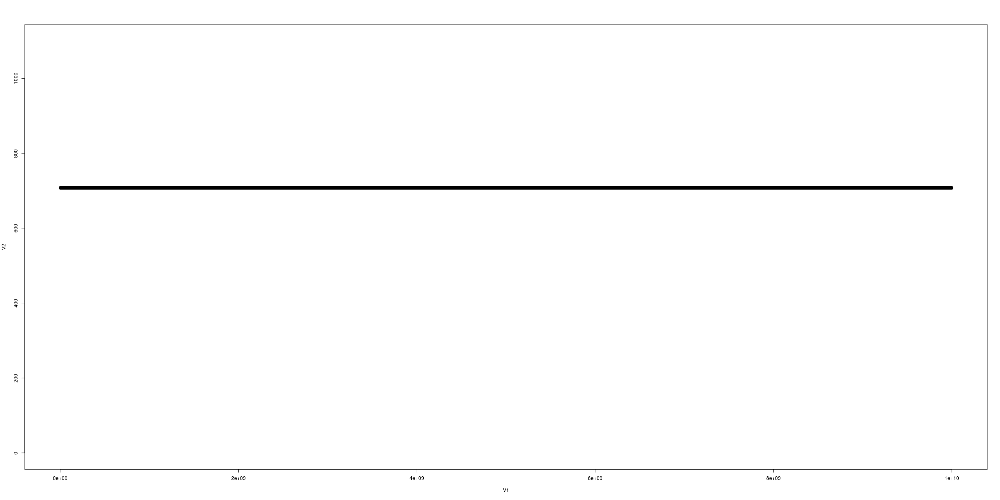
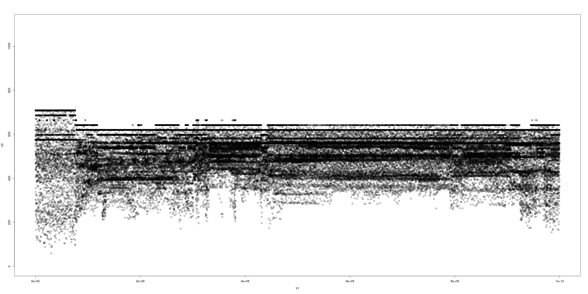

# Bands and Various Anomalies
Barret Rhoden <brho@google.com> \
2017 or so

> Note from 2025: These are my notes from the last big FTQ overhaul in 2017.

## Background
So a couple weeks ago, there were a few things I was concerned about with FTQ, even when run on native Akaros.
All of them are sorted out to my satisfaction.

Quick reminder: FTQ attempts to do work, measured in 'counts', each of which takes about 140 ns (HW dependent).
It counts how many of these it can do in a Fixed Time Quantum (hence FTQ).
The quantum is usually 100 usec (10 KHz).
I'll refer to the count of work done in a quantum as a sample.

*MCP* cores on Akaros were "quiet": no interrupts, no context switches, etc.
Core 0 ran housekeeping tasks and had a 100 Hz timer tick.

## The Bands
These were common count values for a sample.
The benchmark would often oscillate between them, appearing like a band when 'zoomed out.'
Sometimes they are close (within a few counts), but sometimes they are up to 10% away.
From comments below, a possible "band" could appear due to raw counts repeating the pattern `{710, 711, 710, 720}`.
Example:

###### Akaros on cpu 0, 10kHz (no turbo mode)

> Note from 2025: this might have been after some fixes, and doesn't show the original "bad bands", but still shows the effects of hopping between bands.

AFAICT, these were do to the benchmark or to microarchitectural details.
They were not due to OS interference, turbo mode, or SMM interference or anything like that.

Adding an lfence at the top of each sampling loop helped remove or consolidate the bands.
Slight changes in the benchmark could introduce further banding.
I made the main body of the benchmark OS-independent (compiled with the same compiler with the same alignment settings), so it performed the same on any OS on that hardware.
Specifically, the main_loops function is page aligned to ensure it has the same icache behavior regardless of how ftqcore.o is linked into the main FTQ binary.
That's been enough to get very stable results out of a Haswell.

## The Step Ups
These were major jumps in performance, where all the bands/interference/etc would clearly move up in a graph.

One source of these step-ups is speed-step / CPU-freq governors.
On Linux, you can get around this by using the performance governor (instead of powersave|ondemand).

I don't have an answer for why I thought I saw these on Akaros, since we always run in the 'performance' P-state.
I haven't seen them since I started using lfence to remove banding.
Perhaps there are multiple reasons for them, or my early tests were flawed.

> Note from 2025: I couldn't find a raw data picture of this.

## Core-0 being better than Core 7
It appeared that Core 0 on Akaros (and all cores on Linux) reached higher top-speeds than Akaros's MCP cores.

This appears to be a case of the bands again - artifacts of the benchmark triggering HW artifacts.
The most dramatic was after I fixed a few issues, and on Akaros would regularly get values of {710, 711}.
On about 50% of my MCP runs, I'd get {710, 711, 710, 720} repeated reliably.
That appeared to have a 720 band (where 720 was the highest value on Core 0).
Core 7 was able to get that fast, it just depended on some setting - perhaps something that could get 'kicked on' by interference (which core 0 has).
This anomaly went away after the following story:

To show how touchy this stuff can be, consider the case of a slight code change.
I refactored the struct sample{} ever so slightly - enough to put in 4 bytes of a shift instruction before the main loop (not in the main loop).
This was enough to induce the compiler to insert more and longer nops (to align loop targets).
That was enough to increase the instruction decode stalls by 10x (thanks perf!), and overall lower the 'top speed' of FTQ substantially.

In the end (the current state of the FTQ repo), Akaros native MCP cores show no interference, just like they are supposed to, and they run at full speed.

## SMM or Mystical Sources of Interference

According to an MSR, we're not getting any SMM interrupts.
Once I resolved the bands / step-ups / and other issues, I no longer worried that I didn't cast a spell correctly or otherwise messed up an x86 incantation.

Other than those four concerns, I had a few other ones that I sorted
out, some of which I mentioned to some of you:

## The 40 Hz Signal
On some of my runs, even on MCP cores, I'd see a slight signal at 40 Hz.
That sounded familiar - even during my work with FTQ back at Berkeley, the quietest machines would sometimes have that.

I'm fairly certain that's a TLB miss (or an un-prefetchable cache miss).
When we write out our samples[] value, the time it takes to do that store gets counted as interference.
Samples are 16 bytes, and there are 256 of them per page.
If you do the math, at a sampling rate of 10 KHz, it works out to 40 Hz.

Now, how can we know it is not something else?
I ran FTQ at a sampling rate of 7 KHz.
The 40 Hz signal in the output moved to around 27 Hz.
If you do the math, we get the same result: every 256 samples, there's a slight hit.

The moral of the story is that you need to run FTQ at two different frequencies, neither of which is a multiple of the other, so that we can see if a signal is due to the benchmark or an external source of interference (like the OS).

## Sampling Drift

If you look at the timestamps in the raw data, they are supposed to all be close to a boundary: e.g. increments of 100 usec.
They weren't.

The issue was improperly converting from TSC ticks to nsec.
If the invariant TSC freq is 2.4 GHz, but the benchmark computed it as 2.3982, it'll slowly drift.
We have an option where you can tell FTQ the ticks-per-nsec.

## Turbo Mode Effects

I was expecting to see turbo mode effects on MCP cores.

When Akaros core 0 turns on (periodically, e.g. timer tick), I mistakenly thought I should see a slow down on core 7.
That's not the case: on my machines (Haswell), you can run two cores at the max turbo ratio.
If you spin one core (e.g. 4), then run FTQ on 7, then you *can* see the effect of core 7 dropping to a lower freq in response to core 0 turning on.
It's pretty cool: the same signals you get on core 0 appear on core 7.

Fun tidbit: when core 7 stepped down to its new freq (when core 0 turned on), it would briefly get some values lower than its new freq.
For example, say its max is 0x20.
When three cores are online, it's 0x1e.
If it always ran at 0x1e, we'd see no effect of core 0 waking up.
When it runs at 0x20 and has to slow down, we'll see a band at 0x1e, but also a cloud of values below 0x1e.

## Warm-up Issues
Some machines needed a little 'warm-up' time.
Previously, FTQ would run for 1000 loops and throw the results away.
AFAICT, this is to avoid machine-dependent interference early on.

It turns out that 1000 samples is a bad idea, since this interference is based on time: not work, icache preloading, or anything like that.
On my 8-cpu desktop, I reliably see a 100 Hz signal for the first 180 msec or so - every time, and for both Akaros and Linux.
I don't see it on a larger Haswell.
I was able to muck around a little with it, but for the most part, I couldn't turn it off and don't know what it was.
Doing a udelay() in the FTQ worker threads got around this.
(That's now an option to FTQ).

## Conclusion
That's the major stuff with fixing up FTQ.
I'm now fairly confident it's doing the right thing and can trust its results.

Short version of early results:
### MCP cores are rock solid
I can actually tell from looking at the raw data if it was core 0 or core 7.
No turbo effects, since at most two cpus are on at a time:
###### Akaros on cpu 0, 10kHz (with turbo)

###### Akaros on cpu 7, 10kHz (with turbo)

### Tinycore Linux native isn't bad
Isn't great either.
###### Tinycore Linux on cpu 0, 10kHz (with turbo)

###### Tinycore Linux on cpu 7, 10kHz (with turbo)

### VM guests are very noisy
VM guests are very noisy, and don't get to the max turbo mode much.

> Note from 2025: not sure if these were guest cpus 0 and 7 or host cpus 0 and 7.
If the latter case, these might be single-cpu VMs?
Though later on, it sounds like there are multiple guest cpus.

###### Tinycore Linux *Guest* on cpu 0, 10kHz (with turbo)

###### Tinycore Linux *Guest* on cpu 7, 10kHz (with turbo)

### VM guests with the greedy scheduler are OK
VM guests with the greedy scheduler are about as steady as tinycore native, which is pretty good for our VMM.
They are different tinycore kernels/configs btw.
But it can't get to max turbo speeds either.
That's because the guest halts the cores at C1, but you need to mwait to C2 or below to allow other cores to turbo-boost.
I have plans for this.
Oh, and Vcore 0 is spinning.
I also have plans for that.

> Note from 2025: not sure how many guest cpus there are - the reference to mwait makes it sound like there are multiple guest cpus.
The greedy scheduler was a reference to the VMM's second-level-scheduler (2LS).
Specifically, never yield cpus to the host kernel, let the guest mwait/halt a cpu, assign a single thread to every (v)core and only ever run that thread there.
Grep [this file](https://github.com/brho/akaros/blob/master/user/vmm/sched.c) for *greed* for more info.

###### Tinycore Linux *Guest* on cpu 0, Greedy, 10kHz (with turbo)

###### Tinycore Linux *Guest* on cpu 7, Greedy, 10kHz (with turbo)

